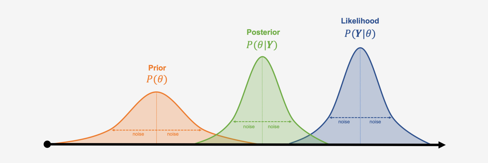

Get in touch if you need some help with your Statistics project or even if you have one in mind. I'd love to discuss how I can help you.

## My expertise!

### Programming 
* SAS 
* R 
* Python
* Latex

### Stats and Math
* Inferential Statistics, Frequentist and Bayesian
* Probability
* Linear Models and Generalization (e.g. OLS, GLM, GAM, Ridge, Lasso)
* Machine Learning and Statistical Learning
* Calculus
* Linear Algebra
* Financial Mathematics
* Sthocastic Finance

{: .mx-auto.d-block :}

